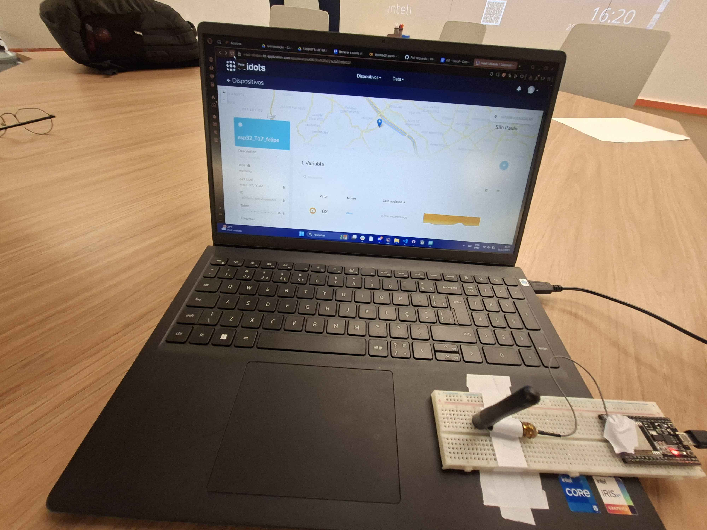
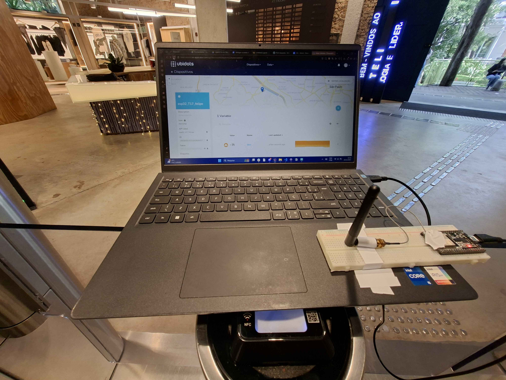
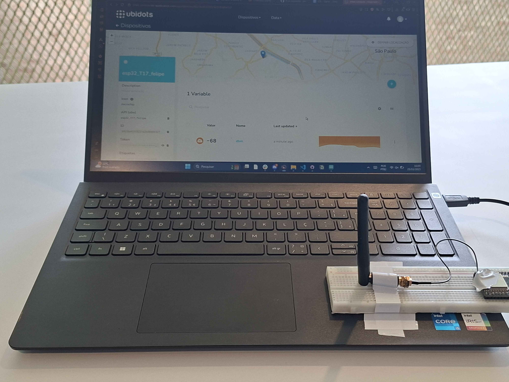
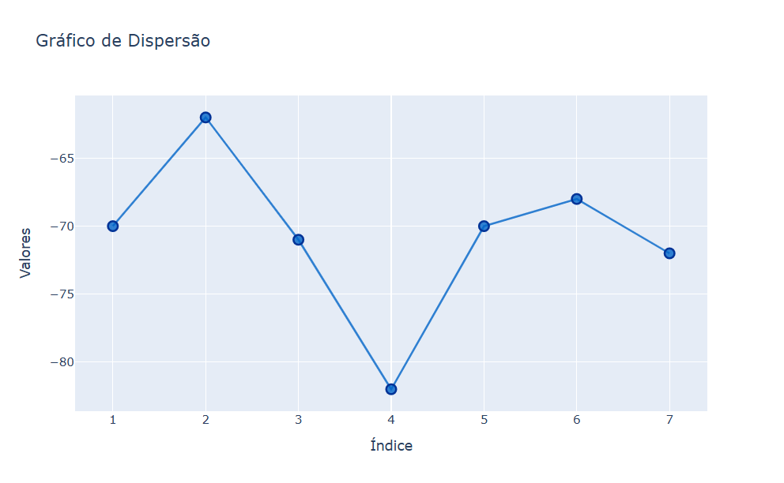

# Teste_VelocidadeDBM

Este projeto realiza a coleta e análise de potência de sinal WiFi em dBm utilizando um ESP32 conectado a uma rede WiFi. O objetivo é medir a radiofrequência em cenários distintos dentro do Inteli e simular o efeito de uma gaiola de Faraday utilizando o elevador.

## Locais do teste

1. Sala de aula

-62

2. Catraca da recepção

-71

3. Posto do IT Bar - 1º andar

-82

4. Elevador com porta fechada

-70

5. Laboratório - 2º andar

-72

6. Última salinha de reunião do mesanino

-68

7. Portaria no lado de fora do Inteli

-70

## Gráfico de dispersão

O gráfico permite visualizar claramente o impacto do ambiente físico na intensidade do sinal.

Gráfico de dispersão feito com python

## Objetivo do Projeto

Implementar um sistema IoT completo com ESP32, MQTT e dashboard online para monitorar em tempo real a qualidade do sinal WiFi em diferentes ambientes e demonstrar o efeito de blindagem eletromagnética.